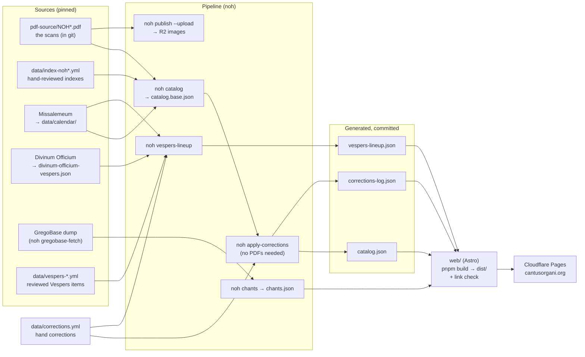

# How Cantus Organi fits together

Sources go through the pipeline (Python, `noh`) to data files in git, and the
site (Astro, static) is built from those files. Corrections are an overlay on
the data, never edits to generated files. For how to fix things, see
[EDITING.md](EDITING.md).

## The parts

| Part | Where | What it does |
|---|---|---|
| **Pipeline** | `pipeline/` (`uv run noh …`) | Reads the scans (`pdf-source/`, in git), splits pages into systems, reads the printed indexes and the calendar, and writes the data files. A catalogue rebuild also reads `data/published/` and `data/ocr/margins/`, so it gives the same result anywhere; only uploading images needs the R2 keys. |
| **Data** | `data/` | Reviewed inputs (`index-*.yml`, `vespers-*.yml`, `rubrics-1962.yml`, `corrections.yml`), vendored sources, and generated outputs (`catalog*.json`, `vespers-lineup.json`, `chants.json`, `corrections-log.json`). The generated outputs are committed, so the site builds from git alone. |
| **Site** | `web/` | A static Astro site built from `data/`. `pnpm build` ends by crawling `dist/` and fails if any page can't be reached by a link. Page images come from R2 (`images.cantusorgani.org`). |
| **Admin API** | `web/functions/` → `web/src/lib/admin/` | Pages Functions behind Cloudflare Access: the corrections queue, editors' own fixes, and publishing a batch. |
| **Corrections Worker** | `workers/corrections/` | Takes readers' reports from the Corrections form (Turnstile, rate limit) into D1. Its migrations are the database schema, shared with the admin API. |
| **CI** | `.github/workflows/site.yml` | On every pull request: tests, secret scan, checks that corrections are applied, build and link check. On `main`: the same, then deploy. |
| **Publishing** | `.github/workflows/corrections-batch.yml` | Runs when the admin screen publishes: records the batch (`noh correct-batch`), rebuilds the chant notation, and opens a pull request as the GitHub App. |
| **Rebuilding** | `.github/workflows/catalog-rebuild.yml` | Run by hand from the Actions tab: rebuilds a volume's catalogue from the scans after an index edit, on a branch or as a pull request. |
| **Images** | `.github/workflows/publish.yml` | Run by hand from the Actions tab: slices the PDF pages named, uploads their images to R2, and rebuilds that volume's catalogue so it names them; on a branch or as a pull request. |

## A correction's journey

1. A reader reports it (Corrections form → Worker → D1), or an editor makes it
   (admin screen → D1).
2. An editor accepts it on `/admin/`, then **Publish changes**. The admin API
   asks GitHub to run `corrections-batch`.
3. The workflow runs `noh correct-batch`: it checks each entry against the data
   and records it in `data/corrections.yml` with the value it replaces
   (`was`). Then `noh apply-corrections` rewrites the generated files, and the
   workflow opens a pull request.
4. The site workflow checks the pull request. The owner merges it, and the
   merge deploys.
5. GitHub's webhook tells the admin API what happened. The report is marked
   accepted (with the merge commit), back to review (closed unmerged), or back
   to approved (the workflow failed).

What a correction can name: `piece:<slug>` (title, incipit, mode, genre,
printed pages), `part:<slug>/<part>` (where it starts, its chant) and
`vespers:<office>/<item>` (tone, chant). The rules for each field live in one
file, `data/schema/corrections.json`, read by the pipeline, the admin API and
the Corrections form.

## Which day is it?

The calendar (`data/calendar/`, from Missalemeum) gives each date its
celebration keys (`tempora:Pent18-0`, `sancti:12-25m3`, …). The pipeline
decides which office a date keeps, and which key names it. For Vespers that is
each lineup day's `observance`, so the site looks titles up rather than
working them out. `normal_key` (dropping a resumed Sunday's `r` or a Christmas
Mass's `m1`–`m3`) is the one rule both sides share, for matching a day page to
its Vespers.

## Which page is it?

Each volume's page map (`data/derived-offsets.json`, from `noh offset
--segments`) turns printed pages into PDF pages. NOH3 also binds two addenda
(Queenship of Our Lady and St Pius X, both 1954) that number their pages
afresh. `data/volumes.yml` declares them under `addenda`, and each gets its own
page-map segment with a `pagination` id. An index entry printed in one names
that id, and so does its piece, so the site reads "Addenda ad Partem III,
pp. 3–11". A page reference in a rubric ("Pars III, p. 5") always means the
body. The addenda are printed faintly, so their staves are found with the
settings under "faint print" in `pipeline/segment.py`.

## Where the code is

- `pipeline/catalog.py`, `parts.py`: pieces, and the Proper parts within them.
- `pipeline/indexextract/`: reading a printed index (`table.py`), matching its
  entries to headings and the calendar (`matching.py`), reading pages
  (`pages.py`), proposals and their checks (`proposals.py`), and catalogues read
  from the body's headings (`headings.py`).
- `pipeline/vespers/`: each date's Vespers, in the order sung: `calendar.py`
  (Easter, seasons, Marian antiphons), `reviewed.py` (the reviewed files, with
  their corrections), `music.py` (each item's systems, tone-bank formula or
  note), `lineup.py` (the lineup), `proposal.py` (Magnificat antiphons read
  from the scans). `vesperitems.py`: aligning texts to the scans (proposals for
  review). Both packages re-export every name, so `from pipeline.vespers import
  …` still works.
- `data/sections/`: a Proper's sections as a person checked them, applied with
  the hand corrections (`pipeline/sections.py`).
- `data/vespers/`: the reviewed Vespers files, the lineup and the vendored
  Vespers sources.
- `pipeline/corrections.py`: the overlay (`noh correct`, `apply-corrections`,
  `correct-batch`); system ranges apply first, and every other correction
  counts from them; `where.py`: `noh where`.
- `web/src/lib/admin/`: the admin screen; `scans.ts` picks the systems shown
  beside a correction, from `/admin/scans.json`.
- `web/src/lib/`: catalogue, calendar, Vespers and admin code, each with its
  tests beside it.
