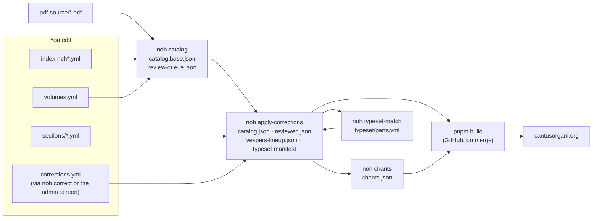

# Running Cantus Organi yourself

This is the owner's manual: how the pieces depend on each other, what to run
after which change, how a change gets from your laptop to the site, and what to
do when something goes wrong. For *how to fix a particular thing* (a title, a
part's start, a day's Mass), use the recipes in [EDITING.md](EDITING.md). For
*how the code is laid out*, see [ARCHITECTURE.md](ARCHITECTURE.md).

- [The idea in six lines](#the-idea-in-six-lines)
- [Where to start](#where-to-start)
- [Admin screen or repository?](#admin-screen-or-repository)
- [The data files](#the-data-files)
- [Regenerating](#regenerating)
- [Checking](#checking)
- [From your laptop to the site](#from-your-laptop-to-the-site)
- [Images: scans and typeset music](#images-scans-and-typeset-music)
- [The review queue](#the-review-queue)
- [Situations the recipes don't cover](#situations-the-recipes-dont-cover)
- [When something goes wrong](#when-something-goes-wrong)
- [A routine](#a-routine)

---

## The idea in six lines

1. **The scans** (`pdf-source/NOH*.pdf`) and **the reviewed indexes**
   (`data/index-noh*.yml`) are the sources.
2. **`noh catalog`** reads the scans into pieces, systems and Proper parts:
   `data/catalog.base.json`, plus `data/review-queue.json` for what it was unsure of.
3. **Your judgement** is kept apart, in files the pipeline never overwrites:
   `data/corrections.yml`, `data/sections/*.yml`, `data/volumes.yml`, the index files.
4. **`noh apply-corrections`** lays your judgement over the catalogue:
   `data/catalog.json`, which is what the site shows.
5. **The site** (`web/`, Astro) is built from `data/` alone, and deployed by
   GitHub when `main` changes.
6. **Images** (page systems, typeset music) live on R2 at `images.cantusorgani.org`;
   the site only links to them.

So: **never edit a generated file**; change a source or record a correction,
then regenerate. Every generated file can be rebuilt from git.



---

## Where to start

### Once: set up your machine

From the main checkout (`~/development/nova-organi-harmonia-online`):

```bash
uv sync
```

```bash
pnpm --dir web install
```

```bash
uv run noh doctor
```

`noh doctor` names the fix for anything missing. R2 failures only matter for
uploading images, which you can leave to GitHub (below).

### Your first hour

1. **Look at what's left.** Open `https://cantusorgani.org/admin/review/`. The
   three tabs are *to fix*, *to check against the scan*, and *for information*
   (nothing to do). Work the first two; ignore the third.
2. **Make one small fix from the admin screen** (a title, say: the **Edit** link
   at the foot of any piece page). Press **Publish changes** on `/admin/`.
   Watch the pull request appear on GitHub, its checks pass, and the site update
   a few minutes after it merges. That's the whole loop for most changes.
3. **Make one fix from the repository**, to see the other loop:

   ```bash
   uv run noh where https://cantusorgani.org/piece/dominica-i-adventus/
   ```

   It tells you the target and the file. Make a branch, record the change with
   `noh correct`, run `scripts/check.sh --quick`, push, open a pull request, and
   merge it when its checks pass (details in
   [From your laptop to the site](#from-your-laptop-to-the-site)).

After that, use the [routine](#a-routine) at the end of this page.

---

## Admin screen or repository?

| You want to… | Use | Why |
|---|---|---|
| Fix a title, incipit, mode, printed pages | Admin screen (**Edit**) | Approved at once, published as a pull request that merges itself |
| Move where a part or Mass movement starts | Admin screen (**Edit** → part) | Same |
| Rewrite a Proper's list of sections | Admin screen (**Sections**), or `data/sections/*.yml` | The screen shows the systems beside the list |
| Confirm a review item | Admin screen (**Looks right**) | Recorded as a `reviewed` correction |
| Choose which part a typeset file is | Admin screen (**Typeset music**) | |
| Accept or reject a reader's report | Admin screen (`/admin/`) | |
| Confirm many review items at once | Repository: `noh correct-batch` | The screen does one at a time ([how](#confirming-many-items-at-once)) |
| Change a day's Mass, a piece's page, a rubric | Repository: `data/index-*.yml`, then rebuild that volume | Needs `noh catalog` |
| Re-slice a badly cut page | Repository: `data/volumes.yml`, then the **publish** workflow | Needs new images |
| Merge or split pieces, mark a rubric-only piece | Repository: index + sections | [Situations](#situations-the-recipes-dont-cover) |
| Change code | Repository | |

The admin screen can do everything that is a *correction*. Anything that
changes how the scans are *read* goes through the repository.

---

## The data files

**You edit these** (by hand, or through a command that writes them):

| File | What it is | How to change it |
|---|---|---|
| `data/index-noh*.yml` | Each volume's pieces: page, title, days, genre, references | By hand; then `scripts/regenerate.sh <volume>` |
| `data/volumes.yml` | Each scan: page map hints, `staff_finder` page fixes, inserted leaves (`inserts`), addenda | By hand; then re-slice and rebuild |
| `data/sections/noh*.yml` | A Proper's sections as a person checked them: **the whole truth for that piece** | By hand, `noh sections <slug> --review`, or the Sections screen; then `noh apply-corrections` |
| `data/corrections.yml` | Every hand correction and review confirmation, each with the value it replaced (`was`) | `noh correct`, `noh correct-batch`, the admin screen. Don't type entries by hand |
| `data/rubrics-1962.yml` | Days that take another day's Mass, with no line in the book to say so | By hand; then rebuild |
| `data/vespers/vespers-noh8.yml`, `vespers-offices.yml` | Reviewed Vespers items | By hand; then `noh vespers-lineup` |
| `data/typeset/src/**` | The volunteers' LilyPond files (and your fixes to them) | By hand; then `noh typeset-manifest` ([TYPESETTING.md](TYPESETTING.md)) |

**Generated: never edit** (a command rewrites them, and a check fails if they're stale):

| File | Written by |
|---|---|
| `data/catalog.base.json`, `data/review-queue.json` | `noh catalog` |
| `data/catalog.json`, `data/reviewed.json`, `data/corrections-log.json` | `noh apply-corrections` (also run by `noh correct`) |
| `data/vespers/vespers-lineup.json` | `noh vespers-lineup` (and `noh apply-corrections`, for the years it covers) |
| `data/chants.json` | `noh chants` |
| `data/typeset/parts.yml` | `noh typeset-match` |
| `data/typeset/manifest.json`, `review.json` | `noh typeset-manifest` (and `noh apply-corrections`) |
| `data/published/*.json` | `noh publish` (the record of which images are on R2) |
| `data/ocr/margins/**` | `noh catalog` (cached margin readings; commit them) |
| Vendored sources (`jgabc-propers.json`, `divinum-officium-vespers.json`, `vesperale-lineup.json`) | their `noh …-fetch` command |

When git shows a conflict in a generated file, don't merge it by hand: see
[Merging main into a branch](#merging-main-into-a-branch).

---

## Regenerating

### One command

```bash
scripts/regenerate.sh
```

After any hand edit to `data/`. Runs, in order: apply the corrections, the
chant notation, the typeset matching, the corrections again (typeset
corrections are checked against the new matching), the typeset manifest and its
check, and lists any confirmation a rebuild has undone. About two minutes. It is
safe to run twice: the second run changes nothing.

```bash
scripts/regenerate.sh noh1 noh3
```

Rebuilds those volumes from the scans first (2–7 minutes each), then does the
above. Use it after an edit to `index-*.yml` or `volumes.yml`. `all` rebuilds
every volume (about half an hour).

It ends by listing what changed under `data/`. Read that list: it's what you'll
commit.

### Which volumes?

| Volume | Book |
|---|---|
| `noh1` | Pars I: Proprium de Tempore, Advent to Holy Saturday |
| `noh2` | Pars II: Proprium de Tempore, Easter to the last Sunday after Pentecost |
| `noh3` | Pars III: Proprium Sanctorum (and its two 1954 addenda) |
| `noh4` | Pars IV: Commune Sanctorum, votive Masses, local feasts |
| `noh5` | Pars V: Kyriale, Requiem, cantus ad libitum |
| `noh8` | Pars VIII: Vespers |

### What to run after what

| You changed | Run | Time |
|---|---|---|
| Nothing by hand; just checking it's current | `scripts/regenerate.sh` | ~2 min |
| `corrections.yml` (through `noh correct`) | nothing: `noh correct` regenerates | — |
| `corrections.yml` (through `noh correct-batch`, or dropped an entry) | `noh apply-corrections` | seconds |
| `sections/*.yml` | `scripts/regenerate.sh` | ~2 min |
| `index-noh*.yml` (a page, a day, `no_music`, a reference) | `scripts/regenerate.sh <volume>` | 3–8 min |
| `volumes.yml` `staff_finder` or `inserts` | re-slice (the **publish** workflow), then `scripts/regenerate.sh <volume>` | ~15 min |
| `rubrics-1962.yml` | `scripts/regenerate.sh <any volume>` (rubrics link across volumes) | 3–8 min |
| A typeset `.ly` file | `noh typeset-manifest`, `noh typeset-check` | seconds |
| `vespers-*.yml` | `noh vespers-lineup` | seconds |
| Code under `pipeline/` that reads the scans | `scripts/regenerate.sh all` | ~30 min |
| Merged `main` into your branch | [see below](#merging-main-into-a-branch) | |

The individual commands, if you want them:

```bash
uv run noh catalog --volume noh3     # scans → catalog.base.json, review-queue.json, then applies corrections
uv run noh apply-corrections         # corrections + sections → catalog.json, reviewed.json, lineup, manifest
uv run noh chants                    # chants.json
uv run noh typeset-match             # typeset/parts.yml
uv run noh typeset-manifest          # typeset/manifest.json, review.json
uv run noh typeset-check             # the typeset checks CI runs
uv run noh vespers-lineup            # vespers-lineup.json
uv run noh corrections --lapsed      # confirmations a rebuild undid
```

---

## Checking

```bash
scripts/check.sh --quick
```

Everything a pull request checks except the site build and browser tests:
lint, the pipeline tests, "corrections applied", the typeset checks, "chant
notation current", the site's type check and tests, the corrections Worker's
tests. About five minutes. Run it before every push.

```bash
scripts/check.sh
```

Adds the build (with the link check: every page must be reachable) and the
browser tests of the admin screen and forms. About eight minutes. Run it before
a change to `web/`, or when `--quick` passes but GitHub fails.

Both stop at the first failure and print `FAILED at: <step>`. The step's own
output above that line says what's wrong; [When something goes
wrong](#when-something-goes-wrong) lists the usual ones.

**Looking at the site locally:**

```bash
pnpm --dir web dev
```

Opens at `http://localhost:4321`. From the main checkout it reads the real
images (the 1Password mount `web/.env`); approve 1Password's prompt if it
appears.

---

## From your laptop to the site

### The normal path

```bash
git switch main && git pull
```

```bash
git switch -c fix/<what-you-are-fixing>
```

Make the change, regenerate, check:

```bash
scripts/regenerate.sh
```

```bash
scripts/check.sh --quick
```

Commit everything the regenerate step changed along with your edit (the
generated files are committed on purpose: the site builds from git alone):

```bash
git add -A && git commit -m "Fix the Ember Saturday Graduals"
```

```bash
git push -u origin HEAD
```

```bash
gh pr create --fill
```

GitHub runs the same checks (the **site** workflow, about 4 minutes). When
they're green, merge the pull request on GitHub. Merging deploys: the site
changes about 2 minutes later. A change to `docs/` or `*.md` only deploys
nothing.

### Pull requests from the admin screen

**Publish changes** on `/admin/` sends everything approved as one pull request
(a branch named `corrections/<batch>`). Most merge themselves when their checks
pass. A batch waits for you to merge it when it moves systems between pieces or
has 25 corrections or more; the pull request says which. If a check fails, the
pull request closes and the corrections return to **Approved** with the reason.

### Merging main into a branch

When your branch and `main` have both changed generated files, git reports
conflicts in them. Don't resolve those by hand. Take `main`'s copy of every
generated file, keep your own sources, and regenerate:

```bash
git merge origin/main
```

For each conflicted *generated* file (see [the list](#the-data-files)):

```bash
git checkout --theirs data/catalog.json data/catalog.base.json data/review-queue.json data/reviewed.json data/corrections-log.json data/typeset/parts.yml data/typeset/manifest.json data/typeset/review.json data/vespers/vespers-lineup.json data/chants.json
```

(`--theirs` during a merge means the branch being merged in, here `main`.)
Resolve conflicts in *source* files (`corrections.yml`, `sections/*.yml`,
`index-*.yml`) by hand: keep both sides' entries. Then rebuild every volume
either side rebuilt, regenerate, check and commit:

```bash
scripts/regenerate.sh noh3
```

```bash
scripts/check.sh --quick && git add -A && git commit --no-edit
```

If `noh apply-corrections` then reports a **stale correction**, a rebuild on
one side changed the value a correction was made against: read
[When something goes wrong](#when-something-goes-wrong).

### Pull requests that build on each other

If you open a second pull request from a branch that started from the first
one's branch, point the second at `main` (not at the first branch). Otherwise,
when the first merges and its branch is deleted, the second merges into a dead
branch. A pull request aimed at `main` that contains the first one's commits
simply shrinks once the first merges.

### Rolling back

On Cloudflare: Workers & Pages → cantusorgani → Deployments → **Rollback** on
the last good deployment. Then revert the commit on GitHub (the pull request's
**Revert** button) so the next deploy doesn't bring the problem back.

---

## Images: scans and typeset music

**Scan images** (each system of each page) are made by `noh publish` and
uploaded to R2. You don't need the R2 keys on your machine. Use the **publish**
workflow on GitHub instead (Actions → publish → Run workflow): choose the
volume, the PDF pages (`36,40-42`), and your branch. It slices those pages,
uploads only images R2 doesn't have (never deletes), records them in
`data/published/<volume>.json`, rebuilds that volume's catalogue, and commits
to your branch. Run one at a time on a branch: a second run started while one
is queued cancels the queued one.

To see a page's cut before publishing (needs nothing secret):

```bash
uv run noh overlay --volume noh3 --pages 140
```

The overlay is written to `build/overlay/`: every staff should sit in a box. If one doesn't, see
"Slicing a page" in [EDITING.md](EDITING.md#slicing-a-page).

**Typeset music** is drawn by LilyPond on GitHub when `main` changes (the
site workflow's typeset job) and uploaded under `typeset/<hash>/`. Old renders
pile up; the **typeset-prune** workflow removes renders nothing names. Run it
unticked first (a dry run) and read its summary. Its grace period keeps
anything uploaded in the last 14 days, so open pull requests keep their renders.
If the site shows scans where you expected typeset music, check the "show
scans" switch in your own browser first: it's remembered per browser.

---

## The review queue

`noh catalog` writes `data/review-queue.json`: everything it was unsure of. The
admin Review screen lists those items, minus what's already done, in three
groups:

- **To fix:** something a correction can fix.
- **To check against the scan:** look, then **Looks right** or **Correct**.
- **For information:** nothing to do. For example, a Proper with no chant
  linked as a whole, or a part printed elsewhere that the site can't find.

An item leaves the screen in one of three ways:

1. **Confirmed.** **Looks right** records a `reviewed` correction holding the
   item's fingerprint. If a later rebuild changes the item, the confirmation
   *lapses* and the item comes back. `noh corrections --lapsed` lists them.
2. **Settled.** The data now answers it: a reviewed section list places or
   borrows the missing part, or a rubric-only piece shows the music it cites.
3. **Gone.** You fixed the source, and the rebuild no longer raises it.

| Kind (as the screen words it) | What it means | Usual answer |
|---|---|---|
| Piece starts partway down a page | Its heading was found below other music | Check the first system; **Looks right** or correct `system_range` |
| Part not found | A part the day should have wasn't located | Place it in the section list, or mark it printed elsewhere (borrowed) |
| Part's opening words do not match | The part found doesn't open with the expected words | Check; correct its start or chant |
| Part to check | A part whose start was inferred, or that is unusually short | Check its start, and the next part's |
| Chant link not confirmed | The GregoBase chant was matched below the confident score | Compare words and mode; **Looks right** or correct the chant |
| No chant linked | Nothing matched | Link a chant if GregoBase has it |
| Mass movement placed by order | A Kyriale movement's opening words matched weakly | Check; move it with a keyed row if wrong |
| Hymn linked to the top of its page | No heading placed the hymn | Check; set `system:` on the hymn in `index-noh8.yml` if wrong |
| No music found for this piece | A piece with no systems | Usually a rubric-only feast: give it a `reference`, or `no_music` |
| Index page number not confirmed | No heading confirmed the index's page | Check the page; **Looks right** |
| Pages added after the index's end | The piece ran past the index's stated last page | Check; **Looks right** |

### Confirming many items at once

When you've checked a list of items (say, against a contact sheet), record them
in one go rather than clicking each. Write a file like this:

```json
{"batch": "b-my-checks-1", "entries": [
  {"target": "review:noh1/starts_mid_page/f84a4861", "field": "reviewed", "value": "yes",
   "note": "scan checked 2026-10-03: heading directly above the first system"}
]}
```

Then:

```bash
uv run noh correct-batch my-checks.json
```

It records all of them or none (at most 100 a batch), each against the item as
it is now. Then run `uv run noh apply-corrections` and commit. The item keys are
in `data/review-queue.json`, or in each Review card's `data-review-target`.

---

## Situations the recipes don't cover

These came up while the queue was being worked down. Each is a small edit to a
source file followed by `scripts/regenerate.sh <volume>`.

### A feast that prints only a rubric

"Sabbato resumitur Missa Feriae praecedentis, praeter Tractum": no music of its
own, just a line below the last system of the page. Give its index entry:

```yaml
    no_music: true          # its rubric is below the page's last system
    reference: 'Sabbato resumitur Missa Feriae praecedentis, praeter Tractum, qui omittitur.'
    reference_sources:
    - volume: noh1
      page: 164
      label: 'Mass of the preceding Friday, omitting the Tract'
      omit: [tract]
```

`no_music` keeps every system on the page with the piece before it.
`reference_sources` shows the cited Mass on this feast's page, and `omit` leaves
parts out. Feasts whose rubric names a page ("Missa. Os justi, Pars IV, p. 76")
need only `reference`: the page is read from it.

### A citation that names the wrong page

The book sometimes cites a page the chant isn't on (Stetit Angelus is cited as
p. 350, printed on p. 360). In a section list, cite the page it's *really* on
(`borrowed_page: 360`), and say why in the pull request.

### Two index entries that are one piece

Ash Wednesday's blessing and its Mass were catalogued as two pieces. To merge:

1. Delete the second entry from `data/index-<volume>.yml`. The first now runs
   to the next piece.
2. In `data/sections/<volume>.yml`, rename the second piece's list to the
   first's slug. Add rows for anything before it (the blessing's antiphons as
   `kind: other` with `n: 1, 2…`). Replace `borrowed_from: <old slug>` everywhere
   with the new one.
3. Add the old address to `web/public/_redirects`:
   `/piece/<old-slug>/ /piece/<new-slug>/ 301`.
4. `scripts/regenerate.sh <volume>`. If a correction targets the old slug, the
   build names it: point it at the new target or drop it.

### A leaf inserted into the book

NOH4 has two pages printed "162 bis" and "163 bis" between 163 and 164. Declare
them in `data/volumes.yml` so they belong to the piece they sit in:

```yaml
    inserts:
    - {after_printed: 163, first_pdf: 195, last_pdf: 196, label: "162 bis-163 bis"}
```

### A hymn the heading search misplaces

In `data/index-noh8.yml`, give the hymn the system it begins on (counting from
0 on its page) and mark it verified:

```yaml
- title: Crudelis Herodes
  page: 93
  system: 3
  status: verified
```

### A page cut wrongly

Add its PDF page to `staff_finder` in `data/volumes.yml`: `refit` for a stray
or missing staff line, `dashed` for dashed staff lines, `plain` when tilt
recovery hurts, `faint` for faint print. Check with `noh overlay`, then
re-slice with the **publish** workflow. Full steps: "Slicing a page" in
[EDITING.md](EDITING.md#slicing-a-page).

### A Mass movement or extra Kyrie, Ite, Benedicamus

Rows with a `key` in `data/sections/noh5.yml`. See "A Mass of the Kyriale" in
[EDITING.md](EDITING.md#a-mass-of-the-kyriale).

---

## When something goes wrong

| You see | It means | Do |
|---|---|---|
| `stale correction c-0007: … was X when the fix was made but the data now says Y` | A rebuild changed the value the correction was made against | If Y is what you wanted, the correction is redundant: `uv run noh corrections --drop c-0007`. If the correction is still needed, set its `was:` in `corrections.yml` to Y. Then `noh apply-corrections` |
| `… is not a part, movement or piece the catalogue has` | A correction or typeset match names a target that no longer exists (a merged or renamed piece, a section list that renamed a part) | Point it at the new target, or drop it |
| `data/catalog.json is not current with corrections.yml` (CI) | The overlay wasn't applied after a change | `uv run noh apply-corrections`, commit |
| `data/chants.json is not current` (CI) | A chant link changed | `uv run noh gregobase-fetch && uv run noh chants`, commit |
| `manifest.json … not current` (CI) | A typeset file or `parts.yml` changed | `uv run noh typeset-manifest`, commit |
| A section list "names a system the piece no longer has" | A re-slice or a range change moved the systems | Check the list against the scan again and fix the ref |
| `N page(s) no link leads to` (build) | A new or renamed piece isn't linked from anywhere | Link it from its day or book section; for a merged piece, add a redirect |
| A browser test fails on the admin screen | Often a test that assumes a kind of review item still exists | Read the test; make it choose whatever is present |
| `FAILED at: corrections applied` locally but not on GitHub | Your branch is missing a regenerate | `scripts/regenerate.sh` |
| The site shows scans instead of typeset music | Probably your browser's "show scans" switch | Turn it off; then check the part has a matched, published file in `/admin/typeset/` |
| A **publish** workflow run was cancelled | A second run on the same branch was queued behind it | Run them one at a time |
| Review items you confirmed came back | A rebuild changed them; the confirmation lapsed | `uv run noh corrections --lapsed`; re-check those items |

When a message isn't in this table, the command that failed usually says what
to do in its own words. `uv run noh doctor` checks the whole setup.

---

## A routine

**Weekly, or when you have an hour:**

1. `/admin/`: handle readers' reports (Accept, Reject, Duplicate), then
   **Publish changes**.
2. `/admin/review/`: work **To fix**, then **To check against the scan**.
   Publish.
3. `/admin/typeset/`: a few proposed matches, a few proofreads. Publish.
4. On GitHub: merge any batch pull request waiting for you.

**After a change in the repository:** branch, edit, `scripts/regenerate.sh`
(with the volume, if you touched an index), `scripts/check.sh --quick`, commit,
push, open a pull request, merge when green.

**Monthly:** run **typeset-prune** as a dry run, then for real if the list looks
right. `uv run noh corrections --lapsed` to see whether anything came back.
